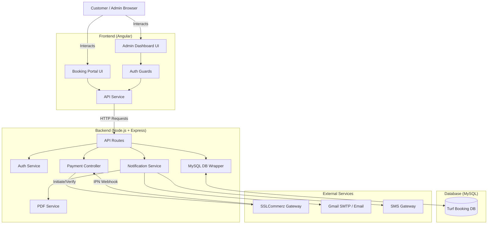
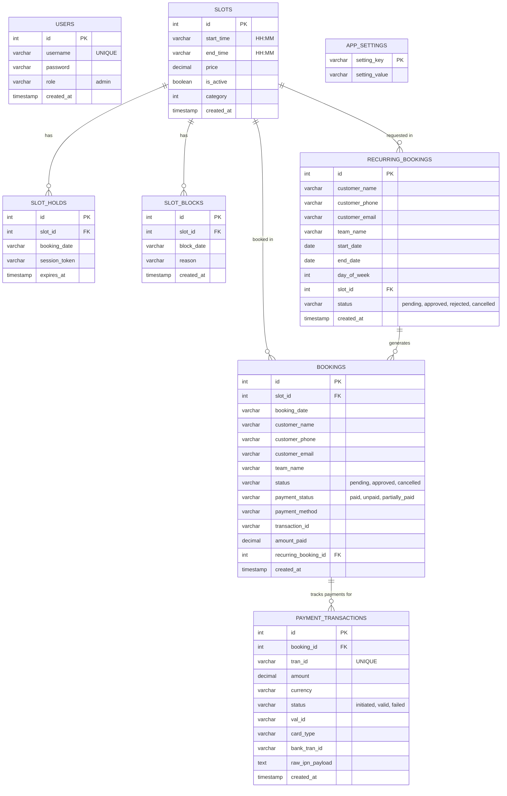

# KICKOFF ARENA - Turf Booking System Architecture

This document provides a comprehensive overview of the Turf Booking project's architecture, database schema, and component interactions.

## 1. System Architecture

The system follows a standard client-server architecture with an Angular frontend, a Node.js/Express backend, and a MySQL database. It integrates with external services for payments and notifications.

## 2. Database Entity-Relationship (ER) Diagram

The database uses MySQL. Below is the ER diagram showing all tables, their primary keys, and relationships.

## 3. Core Features & Business Logic

1. **Slot Management**:
   - `slots`: Defines the time blocks (e.g., 6:00 PM - 7:00 PM).
   - `slot_holds`: Temporary locking (default 5-10 mins) of a slot when a user clicks it, preventing others from booking it simultaneously.
   - `slot_blocks`: Admin-defined blocks for maintenance, holidays, or tournaments.

2. **Booking Flow**:
   - A user selects a slot, holding it temporarily.
   - They fill out their details and choose "Pay Now" or "Pay Later".
   - A `booking` is created. If "Pay Now" is selected, they are redirected to SSLCommerz.
   - Upon successful payment (`payment_transactions` updated via IPN webhook), the booking is auto-approved.

3. **Season / Recurring Bookings**:
   - Customers request a slot for a specific day of the week over a date range.
   - Admin approves it, generating individual `bookings` for each occurrence.

4. **Notifications & PDFs**:
   - The system triggers SMS and Email notifications on booking creation, approval, and payment success.
   - For confirmed bookings, a PDF slip is generated dynamically and attached to the confirmation email, and is also downloadable from the frontend.
